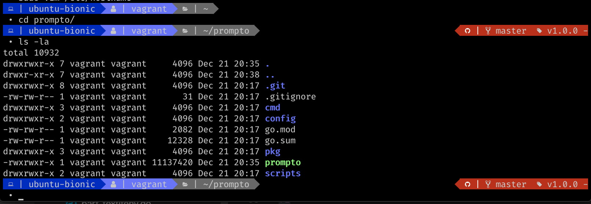

# Prompto

Prompto is dedicated to build your prompt the way you want it based on a simple and readable yaml file

# Usage 

## Install Prompto

You can clone the repository and then build prompto:
```
$ go build -o prompto cmd/prompto/prompto.go
```

## Usage 

Prompto takes its configuration file as parameter: 

```$ prompto $HOME/.prompto.yaml``` 

## Configuration

### Your shell
Somewhere in your `$HOME/.bashrc` (or any file your `.barshrc` loads), write the following functions: 

```shell 
function _update_ps1(){
    PS1="$(/path/to/prompto /path/to/your/.prompto.yaml)"
}


if [ "$TERM" != "linux" ]; then
    PROMPT_COMMAND="_update_ps1;$PROMPT_COMMAND"
fi
```

Take care of changing the path to the Prompto binary and to your configuration file. 

### Prompto

The configuration file repeats the same pattern for each component: 

```yaml
prompters:
- kind: hostname
  before: "  | "
  after: " "
  bgcolor: blue
  fgcolor: default
  font: bold
  side: left
- kind: text
  content: ""
  bgcolor: light-blue
  fgcolor: blue
  side: left
```
The yaml file describes a set of prompters composing your final prompt. Each prompter has a least the following configuration item: 

- `kind`: the definition of the behavior.
- `font`: the font to use. Available keywords depends on your terminal. 
- `bgcolor`/`fgcolor`: the background/foreground color, accepting 8bits color code or equivalent name.
- `brefore`/`after`: any content to be put before/after the expected behavior.
- `side`: the side of the screen to put the final content (left if not set).

Each prompter is set up in the order the appear, being "pushed" on the appropriate side as they are defined. 

Defined behaviours: 
- `username`: your username
- `hostname`: the hostname of your computer
- `text`: plain text you want to set up. It adds a `content` configuration item and `before`/`after` are deactivated
- `path`: the current path. You can set up the `separator` to be used, and the display `mode` (`default`, `short`, `elided`, `initial`).
- `newline`: put a newline to have multiple lines in your prompt. Prompters configured after will appear on a new line. 
- `textifgit`: content to be displayed if in a git repository (same configuration as `text`).
- `textifnotgit`: content to be displayed if not in a git repository (same configuration as `text`).
- `textifenv`: content to be displayed if a specific environment variable (`env`) is displayed (same configuration as `text`).
- `git_branch`: branch name if in a git repository
- `git_tag`: tag name if in a git repository. If no tag is defined, `before` and `after` are not displayed

# Example

The configuration file `config/prompto-00.yaml` results in the following prompt: 

